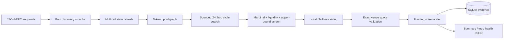

# EVM Arbitrage Scanner

A read-only, multichain DEX arbitrage research scanner written in Rust.

It discovers and caches pool universes, maintains live pool state, enumerates bounded **2-hop / 3-hop / 4-hop atomic cycles**, performs cheap local screening, validates survivors with venue-specific exact quotes, sizes plausible routes, and persists evidence to SQLite and JSON.

**It does not sign, deploy, broadcast, submit bundles, or execute trades.** The public binary contains scanner code only.

> The engineering result is much more impressive than the economics. In the final six-hour benchmark the scanner covered thousands of pools and tens of millions of route candidates; the best observed self-funded opportunity was still only about **$0.07 before execution cost**. That's the point of the project: measure the edge instead of hand-waving it.

## Highlights

- Arbitrum, Base, Optimism enabled by default; Scroll, Linea, zkSync included but disabled by default.
- V2, V3, Algebra, Solidly and Slipstream-style pool support used by the configured chains.
- Bounded graph search across 2/3/4-hop cycles.
- Factory/enumerable-pool universe expansion with persistent cache.
- Multicall-backed state refresh.
- Local AMM math and analytical sizing where safely modelable.
- Exact venue quote validation for survivors.
- Self-funded vs flash-funded screening model.
- Per-chain worker isolation: one bad RPC does not kill healthy chains.
- Shared retry/backoff/rate-limit pacing.
- Graceful Ctrl+C shutdown.
- Atomic JSON artifacts plus persistent SQLite opportunity evidence.
- RPC URLs loaded only from environment variables; transport errors are sanitized so provider URLs/API keys are not logged.

## Final benchmark

A six-hour V3.4.2 observation run (`21,600 s`) produced:

| Chain | Scans | Discovered pools | Hot pools | Best observed profit after financing, before execution cost |
|---|---:|---:|---:|---:|
| Arbitrum | 1,330 | 1,308 | 126 | ~$0.02745 |
| Base | 215 | 1,421 | 247 | ~$0.01196 |
| Optimism | 4,043 | 973 | 110 | **~$0.06965** |
| Linea | 2,140 | 19 | 5 | ~$0.00999 |
| Scroll | 2,155 | 25 | 3 | none |
| zkSync | 1,670 | 38 | 6 | ~$0.03815 |

The benchmark is evidence of scanner behavior, **not a revenue claim**. Route identities can share pools/liquidity, and the breadth-stage execution-fee model is conservative rather than a final execution simulation.

More detail: [`docs/BENCHMARK.md`](docs/BENCHMARK.md).

## Architecture



See [`docs/ARCHITECTURE.md`](docs/ARCHITECTURE.md).

## Quick start

### 1. Requirements

- Rust stable toolchain
- Windows, Linux, or macOS
- At least one usable EVM JSON-RPC endpoint

### 2. Configure RPCs

```powershell
Copy-Item .env.example .env
```

Edit `.env` and set at least one enabled chain RPC. By default `config.toml` enables Arbitrum, Base, and Optimism.

### 3. Verify

```powershell
cargo test --locked
cargo clippy --locked --all-targets
```

### 4. Five-minute smoke test

```powershell
cargo run --release -- --seconds 300
```

### 5. Run continuously

```powershell
cargo run --release
```

Press `Ctrl+C` for graceful shutdown and final artifact generation.

## Outputs

Default output directory: `data/scanner/`

```text
scanner_summary.json
scanner_top_candidates.json
scanner_health.json
opportunities_arbitrum.sqlite
opportunities_base.sqlite
opportunities_optimism.sqlite
pool_cache_<chain>.json
```

`scanner_summary.json` contains chain-level route/search metrics and best candidates. `scanner_top_candidates.json` is the global top-N candidate list. `scanner_health.json` includes per-chain status, last error, scan latency and RPC request/retry/failure/rate-limit counters.

The SQLite files retain interesting route evidence throughout the run, so a final top-N truncation does not erase the observed population.

## Configuration

`config.toml` contains no secrets. Each chain references an environment-variable name such as:

```toml
rpc_url_env = "ARBITRUM_RPC_URL"
```

Useful controls include:

- `poll_interval_ms`
- `rpc_max_attempts`
- `rpc_min_request_spacing_ms`
- `pool_cache_ttl_hours`
- `min_pool_anchor_liquidity_usd`
- `exact_quote_budget_per_scan`
- `max_cycles_per_depth`
- `self_funded_capital_usd`
- `universe_expansion.*`

The scanner validates addresses, chain IDs, configuration bounds and cache compatibility before trusting the data.

## Safety / scope

This repository is intentionally **scanner-only**. It contains no transaction signer, no private-key configuration, no relay submission path, and no public-mempool execution path.

It is also not a profitability guarantee. The scanner can identify pricing discrepancies; whether an opportunity is executable and economically capturable is a separate problem involving latency, ordering, state changes, gas/L1 fees, competition and shared liquidity.

## Releasing changes

On Windows:

```powershell
.\scripts\release-check.ps1
```

CI runs the same core quality gates on pushes and pull requests.

## License

MIT. See [`LICENSE`](LICENSE).
